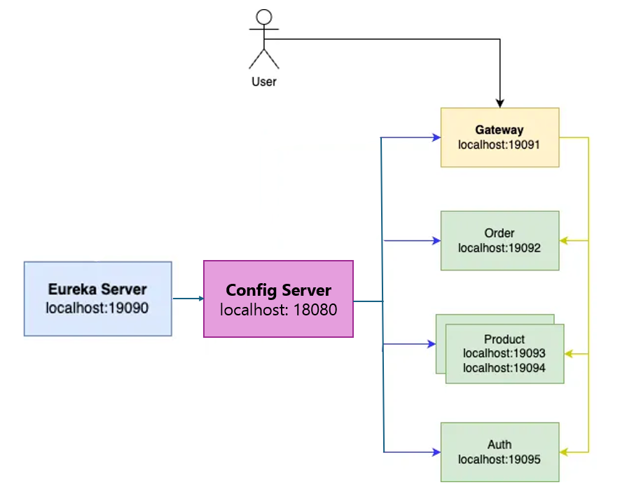
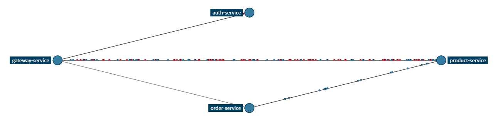

# OverView

| 서비스                   | 패키지명                          | 포트                |
|-----------------------|-------------------------------|-------------------|
| 유레카서버-**eureka server** | `com.sparta.msa_exam`         | `19090`           |
| 게이트웨이-**gateway**     | `com.sparta.msa_exam.gateway` | `19091`           |
| 상품-**product**        | `com.sparta.msa_exam.product` | `19093` , `19094` |
| 주문-**order**          | `com.sparta.msa_exam.order`   | `19092`           |
| 인증-**auth**           | `com.sparta.msa_exam.auth`    | `19095`           |
| 설정-**config**         | `com.sparta.msa_exam.config`  | `18080`           |

# DB
- H2 (인메모리)

# Cache
- Redis Session Clustering

# 기타
- 요구사항 **외부 요청 보호**에 대해서는 도커 네트워크 설정하여 게이트웨이만 노출 시키도록 변경 예정.
- 최초에 헤더로 구현했다가 모든 요청에 넣어주는 것은 불필요하다고 생각하여 제외
  - **외부요청 보호**: Oauth2,JWT 기반으로 인증/인가를 구성하여 인가 없이 `상품 서비스`, `주문 서비스`를 호출할 때
          **401** HTTP ****Status Code를 응답하도록 설정해주세요.
        
- Weighted Load Balancing : Ribbon 옵션 설정으로 구현 할 수 있을 것으로 예상했으나 찾지 못하고 gateway filter로 구현.

# 개선 여지

- OrderService에서 productId 하나당 1개의 요청을 생성하고 있음.
- Order 생성시 OrderId에 productIdList에서 productId 하나당 중간테이블 하나로 맵핑
  - productIdList가 커질수록 SQL문 많아짐.
  - 차라리 idList를 String으로 하고 "," 로 나눠서 저장하는게 성능 면에서는 좋아보임
  - 혹은 연관관계 설정.
    - 서버모드DB가 필요한 사항인듯

- 에러 응답 Illigal로 다 처리해버려서 요청 보내면 서버 에러로 뜨는데, 적절한 응답을 반환할 수 있도록. -> RabbitMQ
- gateway 인증필터에서 인증실패시 서버포트가 반환되지 않음 -> 직접 넣어줘도 되지만 구현한 SetPortToResponseFilter 활용 방안 고민해보기
